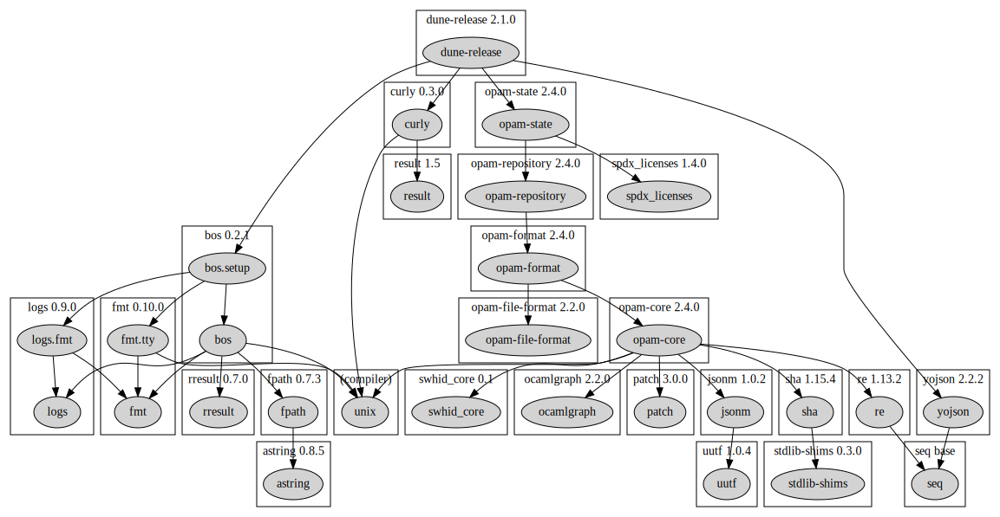
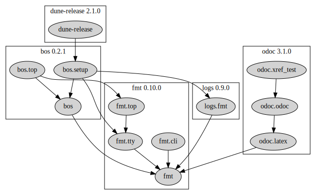

# odep

[](https://github.com/sim642/odep/actions/workflows/ci.yml)
[](https://github.com/sim642/odep/releases)
[](https://opam.ocaml.org/packages/odep)

Dependency graphs for OCaml modules, libraries and packages.

## Installation
```console
opam install odep
```

## Examples

### dune
Dependency graphs for dune project modules and libraries, examples here for this repository.
Includes clusters for libraries and opam packages.

#### xdot
```console
odep dune | xdot -
```
opens `xdot` for interactive dot graph viewing.

#### dot
```console
odep dune | dot -Tsvg > img/dune-odep.svg
```
produces:
[](https://raw.githubusercontent.com/sim642/odep/master/img/dune-odep.svg)

#### Mermaid
```console
odep dune -t mermaid
```
copied into a `mermaid` language block in GitHub Flavored Markdown produces:


### findlib
Dependency graphs for _installed_ findlib libraries.
Includes clusters for opam packages.

#### Dependencies
```console
odep findlib --depends=dune-release
```
[](https://raw.githubusercontent.com/sim642/odep/master/img/findlib-depends-dune-release.svg)

#### Reverse dependencies
```console
odep findlib --rdepends=fmt
```
[](https://raw.githubusercontent.com/sim642/odep/master/img/findlib-rdepends-fmt.svg)

#### Intersection of dependencies and reverse dependencies
```console
odep findlib --depends=dune-release --rdepends=fmt
```
[](https://raw.githubusercontent.com/sim642/odep/master/img/findlib-depends-dune-release-rdepends-fmt.svg)

### opam
Dependency graphs for _installed_ opam packages.

#### Dependencies
```console
odep opam-installed --depends=dune-release
```
[](https://raw.githubusercontent.com/sim642/odep/master/img/opam-depends-dune-release.svg)

#### Reverse dependencies
```console
odep opam-installed --rdepends=fmt
```
[](https://raw.githubusercontent.com/sim642/odep/master/img/opam-rdepends-fmt.svg)

#### Intersection of dependencies and reverse dependencies
```console
odep opam-installed --depends=dune-release --rdepends=fmt
```
[](https://raw.githubusercontent.com/sim642/odep/master/img/opam-depends-dune-release-rdepends-fmt.svg)

## Other tools

* [dune-deps](https://github.com/mjambon/dune-deps) — dune only, custom dune files parsing.
* [not-ocamlfind](https://github.com/chetmurthy/not-ocamlfind) — findlib only.
* [opam-dot](https://github.com/Drup/opam-dot) — opam only, outdated ([fork](https://github.com/sim642/opam-dot)).
* [opam-0install](https://github.com/ocaml-opam/opam-0install-solver?tab=readme-ov-file#dependency-graph) — opam only.
* [depgraph](https://github.com/rgrinberg/ocaml-depgraph) — modules only (via `ocamldep`), inactive.
* [module-graph](https://github.com/ocamlpro/module-graph) — modules only, based on compiled object files.
* [odoc-depgraph](https://github.com/zoggy/odoc_depgraph) — modules only (in `ocamldoc`), inactive.
* [`ocamldoc -dot`](https://v2.ocaml.org/manual/ocamldoc.html) — modules only (in `ocamldoc`).
* [codept](https://github.com/Octachron/codept) — `ocamldep` alternative, has `dot` output, no dune integration.
* [opam-dune-lint](https://github.com/ocurrent/opam-dune-lint) — package-library mapping, no graphing.
