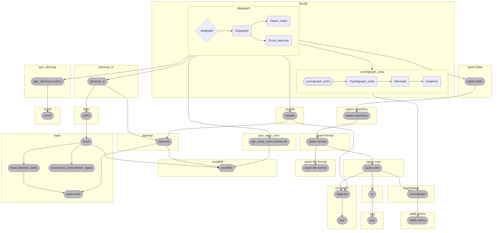

# ocaml-depgraph

Dependency graphs for OCaml modules, libraries and packages.

## Examples

### This package

#### dot

#### Mermaid

## Other tools

* [dune-deps](https://github.com/mjambon/dune-deps) — dune only, custom dune files parsing.
* [opam-dot](https://github.com/Drup/opam-dot) — opam only, outdated ([fork](https://github.com/sim642/opam-dot)).
* [depgraph](https://github.com/rgrinberg/ocaml-depgraph) — modules only (via `ocamldep`), inactive.
* [odoc-depgraph](https://github.com/zoggy/odoc_depgraph) — modules only (in `ocamldoc`), inactive.
* [`ocamldoc -dot`](https://v2.ocaml.org/manual/ocamldoc.html) — modules only (in `ocamldoc`).
* [codept](https://github.com/Octachron/codept) — `ocamldep` alternative, has `dot` output, no dune integration.
* [opam-dune-lint](https://github.com/ocurrent/opam-dune-lint) — package-library mapping, no graphing.
